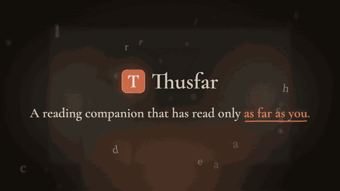
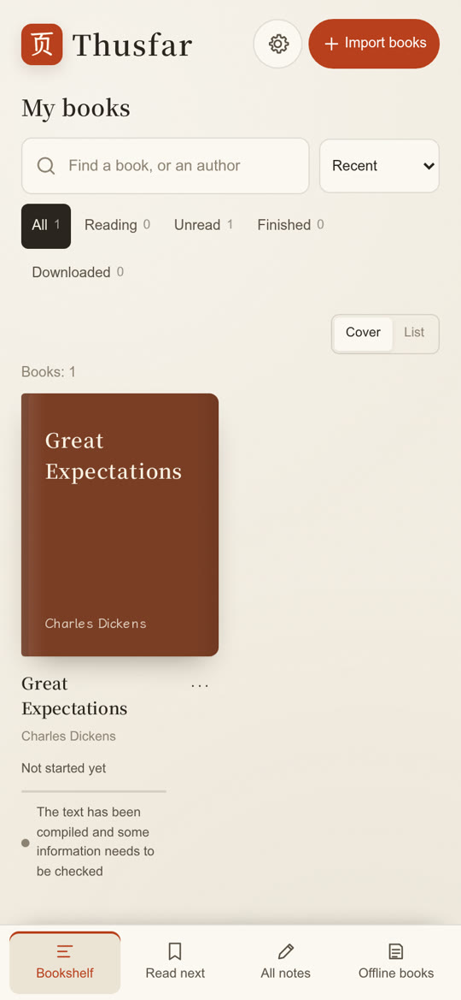
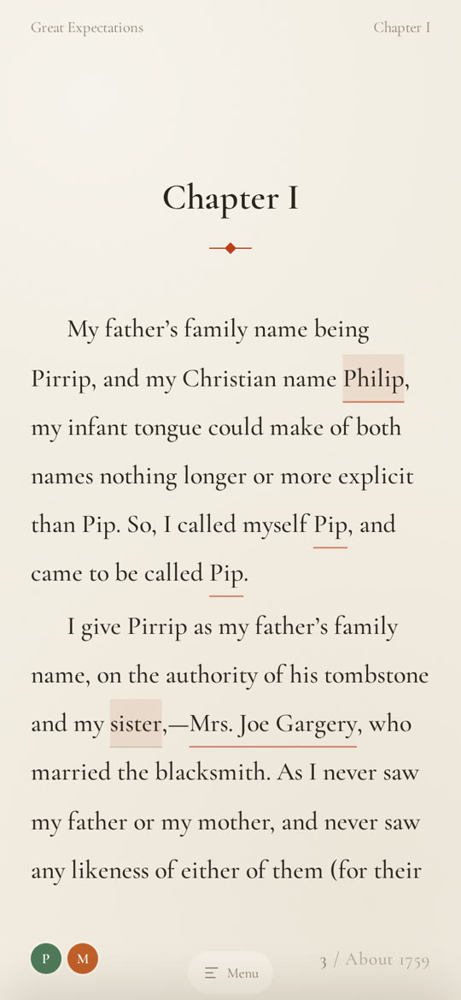
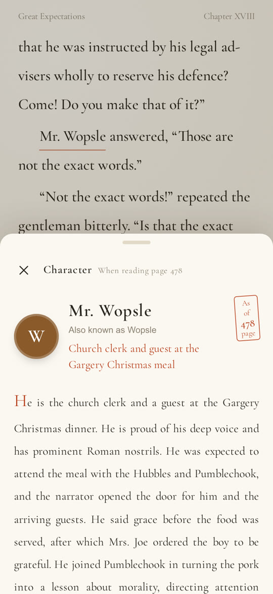

<p align="center">
  
</p>

<h1 align="center">Thusfar</h1>

<p align="center">
  <b>A book reader that has only read as far as you.</b><br>
  Tap any name to see who they are — as of the page you're on. Nothing from later in the book leaks through.
</p>

<p align="center">
  <b>English</b> · <a href="README.zh-CN.md">简体中文</a>
</p>

<p align="center">
  <a href="https://github.com/athemeroy/thusfar/releases/latest"><b>⬇ Download the Android app</b></a> ·
  <a href="#run-it-on-your-computer-docker">Run the web version with Docker</a> ·
  <a href="https://x.com/WangYeruo/status/2103108551799632050">Watch the videos</a>
</p>

<p align="center">
  
</p>

---

## Why

Long books are full of people. Three hundred chapters into a web novel — or a week after you put down *War and Peace* — a name comes back and you can't remember who it is. Flipping back doesn't find it. Searching online finds it, along with the ending.

Asking a chatbot doesn't help either: the model has already read the book, so its memory *is* the spoiler.

Thusfar reads the book once, ahead of time, and pins every fact to the position where it first becomes true. When you're on page 180, the app folds in only what is true by page 180. That is a structural guarantee, not a prompt asking the model to be careful.

## What it does

- **Who is this?** Tap a name: profile, aliases, relations and what they've done so far — only up to your page.
- **It forgets when you flip back.** Jump to an earlier page and the card, the cast list and the relation map shrink to match.
- **Relation map** that grows as you read, with each link labelled (guardian, adopted daughter, brother-in-law…).
- **Ask the book anything** — answers cite the page they come from. Questions about the ending are declined.
- **Lines worth pausing on.** Sentences are scored for feeling, clue, theme and craft; tap one for a few short takes written only from what you've read.
- **Recaps** when you come back after a few weeks; unread chapter titles stay hidden, since titles spoil too.
- **Not only novels:** textbooks, economics, philosophy — tap a term to see what it means *as of this page*.
- **Notes that stay yours:** highlights, bookmarks and thoughts pinned to the text, available offline, exportable as Markdown.
- **Offline reading**, 8 interface languages (English, 简体中文, Español, Français, Deutsch, Português, 日本語, 한국어), books in English, Chinese and Japanese.

<p align="center">
  
  
  
</p>
<p align="center"><sub>Real screenshots of the web version with <i>Great Expectations</i>. The card is stamped with the page it is valid for.</sub></p>

## Get it

### Android

1. Download the APK from [**Releases**](https://github.com/athemeroy/thusfar/releases/latest) and install it (Android 8.0 or later).
2. Import a TXT or EPUB book. Reading works right away, fully offline.
3. To build the character guide, open **AI settings** on the shelf, enter any OpenAI-compatible API (DeepSeek is suggested by default) and your key, then tap **Build the character guide** on the book. Nothing is sent and nothing is spent until you press it.

The whole app — the Python server, the reading pipeline and the web interface — runs inside the phone. There is no account and no server of ours.

### Run it on your computer (Docker)

```bash
git clone https://github.com/athemeroy/thusfar && cd thusfar
cp .env.example .env          # add one model key, e.g. LLM_API_KEY=sk-...
docker compose up -d          # open http://localhost:18770
```

### Or plain Python

No dependencies beyond the standard library (Python 3.11+):

```bash
cp .env.example .env
python3 scripts/sample_books.py jekyll   # optional: fetch a public-domain book
python3 -m server.app                    # http://localhost:18770
```

Set `PASSCODE=` in `.env` before exposing it beyond your own machine. See [docs/SELF-HOSTING.md](docs/SELF-HOSTING.md) for models, costs, the judge and every option.

## How it works

**The language model writes; a judge decides.**

1. **Phase 1, in parallel:** each passage is read on its own and the model extracts people, events, profiles and relations — seeing only that passage.
2. **Phase 2, in order:** passage *k* is merged using only passages 1…*k*. Every record carries the position where it first becomes true.
3. **Reading:** turning a page folds in only the records whose position is ≤ your page.

Anything that can be phrased as a multiple-choice question goes to [JEV](https://classifier.dev), a judge that answers with calibrated probabilities instead of prose: *Is "the lady" here Miss Havisham?* *Does the passage support this sentence?* *Which of 88 relation types is this?* *Is this line worth a comment?* That covers merging characters, checking every generated record against the source, classifying relations, the spoiler guard, and scoring every sentence for comments — without spending LLM tokens.

**Tested with probes written before each run** (what must *not* be visible before page *N*), on books never used for tuning:

| Book | Size | Probes | Real leaks after manual review | Visible once reached |
|---|---|---|---|---|
| *Great Expectations* | 990k characters | 14 | 0 | 14 / 14 |
| 儒林外史 *The Scholars* | 325k characters | 8 | 0 | 6 / 8 |

*Great Expectations* took 19 minutes and about ¥2–3 (≈ $0.30–0.40) to prepare with GPT-5.6 Terra. Estimates for other models are in [docs/SELF-HOSTING.md](docs/SELF-HOSTING.md#花多少钱).

## Privacy

- Books, their graphs, your notes and your API key stay on your device (or your own server).
- To prepare a book, passages are sent to **the model provider you configure** and, by default, to **classifier.dev** (the free, keyless JEV service) for the multiple-choice checks. Reading, notes and search make no network calls.
- You can run your own judge instead: set `JEV_ROUTE=local` and point `CLASSIFIER_URL` at any service speaking the same protocol ([reference server](scripts/judge_server.py)).

## Formats

TXT and EPUB everywhere. MOBI/AZW3 work in the Python/Docker version after `pip install mobi` (that parser is GPL-3.0, so it is not bundled; the Android app asks you to convert to EPUB first).

## Project layout

```
pipeline/   reading a book: parsing, extraction, merging, the judge, relations
server/     HTTP server and API (standard library only)
web/        the interface (no framework, no build step)
android/    Android app embedding the same server via Chaquopy — see android/README.md
scripts/    running books, the reference judge server, release checks
tests/      unit, Node and browser tests; spoiler probes
testsets/   spoiler-probe definitions (probes only, no book text)
docs/       self-hosting and design notes
```

## Development

```bash
python3 -m unittest discover -s tests -p 'test*.py'
for f in tests/*.test.mjs; do node "$f"; done
python3 tests/frontend_browser.py      # needs: pip install playwright && playwright install chromium
```

Contributions are welcome — see [CONTRIBUTING.md](CONTRIBUTING.md). If you change the pipeline and claim it got better, write the spoiler probes first.

## Status and limits

- Android only for the app; the web version runs anywhere Python or Docker does. No iOS build yet.
- Preparing a book needs a network connection and a model key; reading does not.
- The free judge service has daily quotas; a multi-million-character web novel may take more than a day to prepare.
- Non-Chinese interface strings were machine-translated and hand-edited for the main screens; corrections are welcome.

## License

[MIT](LICENSE). Bundled fonts are under the SIL Open Font License (license files alongside them in `web/fonts/`).

Built with [JEV](https://classifier.dev) by typesafe.ai and [Chaquopy](https://chaquo.com/chaquopy/). The launch videos were written entirely in code with Claude Code (Opus 5.5) and Remotion, narrated by Gemini 3.8 Flash TTS.
