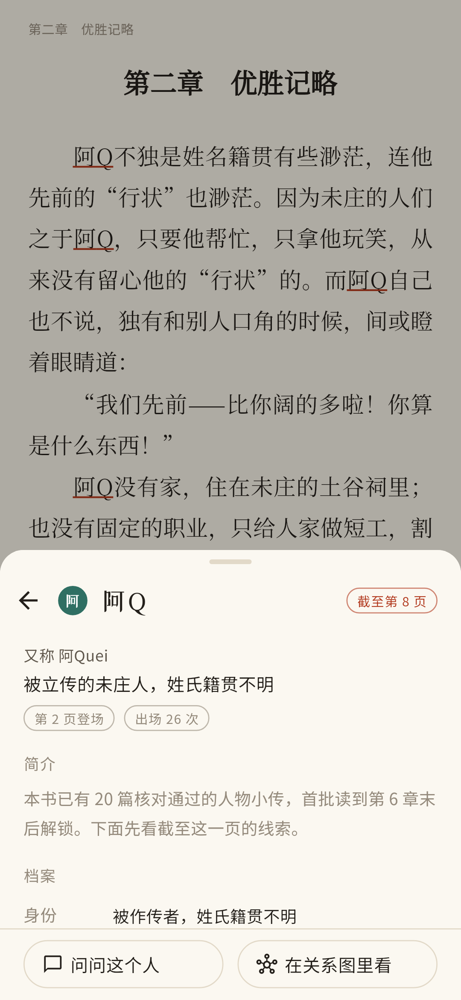

<p align="center">
  
</p>

<h1 align="center">Thusfar · 页读</h1>

<p align="center"><strong>A reader that has only read as far as you.</strong></p>

<p align="center">
  Remember a character, trace a relationship, or ask what happened—without learning what happens next.
</p>

<p align="center">
  <a href="https://github.com/athemeroy/thusfar/releases/latest"><strong>Download 2.0</strong></a>
  &nbsp;·&nbsp; <a href="#see-it-in-action">See the app</a>
  &nbsp;·&nbsp; <a href="README.zh-CN.md">简体中文</a>
</p>

---

A long novel brings back names you have not seen for hundreds of pages. Looking one up on the web can give away the ending. Thusfar marks where each clue first appears. Character cards, relationships, recaps, and answers stop at your current reading position. Go back a chapter, and they go back with you.

## See it in action

<p align="center">
  
  &nbsp;
  
  &nbsp;
  
</p>

<p align="center"><sub>Bookshelf · Reading · Character card at your current page</sub></p>

- **Tap a name.** See a character's identity, aliases, appearances, and relationships, then check the original passage.
- **Catch up without looking ahead.** The cast list, relationship graph, recaps, and questions share the same reading cutoff. Answers link back to cited passages.
- **Make the book yours.** Import TXT or EPUB, take notes, add bookmarks, search, and tune the reading layout. Your books and reading history stay on your device.
- **Choose your own model.** Add a model API to prepare character guides. Preparation uses a connection; everyday reading works offline.

## Download

Get the installation file for your device from the [latest release](https://github.com/athemeroy/thusfar/releases/latest).

| Platform | File | Installation |
| --- | --- | --- |
| Android 8+ | APK | Install the APK. The app appears as 页读. |
| macOS 12+ | DMG | Drag Thusfar to Applications. You may need to allow its first launch in Privacy & Security. |
| Windows 10/11 x64 | Installer or portable ZIP | Install for your user account or extract the ZIP. |
| Linux x64 | tar.gz | Extract and run `./thusfar`; GTK 3 is required. |
| iOS / iPadOS 15+ | Unsigned IPA | Sign and sideload with AltStore or SideStore. |

Android 2.0 can coexist with 1.7.x; each app has its own library. To move books over, export a backup in 1.7.x and restore it in 2.0. [Version 1.7.5 remains available](https://github.com/athemeroy/thusfar/releases/tag/v1.7.5).

## Your data

There is no required Thusfar account or Thusfar server. Books, notes, and model credentials are stored locally in the client. When you choose to prepare a guide, relevant passages go to the model provider you configure and may be checked with classifier.dev. Choose a provider that suits your privacy needs.

## Build from source

The client consists of the Flutter interface in `app/` and the Dart reading engine in `core/`. The 2.0 release uses Flutter 3.47.5 / Dart 3.13.4. Android builds also need JDK 17 and an Android SDK.

```sh
cd app
flutter pub get
flutter run
```

The Android 2.0 package uses the `probe` build flavor:

```sh
flutter build apk --release --flavor probe --target-platform android-arm64
```

See the [client guide](app/README.md) for development and checks, and [CONTRIBUTING.md](CONTRIBUTING.md) to contribute. Thanks to Luna and Gemini Flash for their contributions to the 2.0 client.

## License

[MIT](LICENSE). Bundled fonts retain their own licenses.
