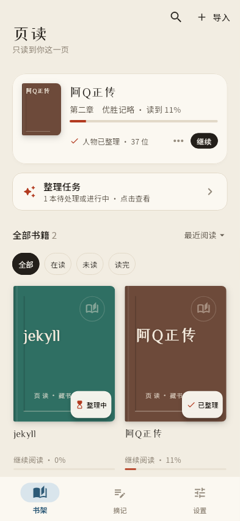
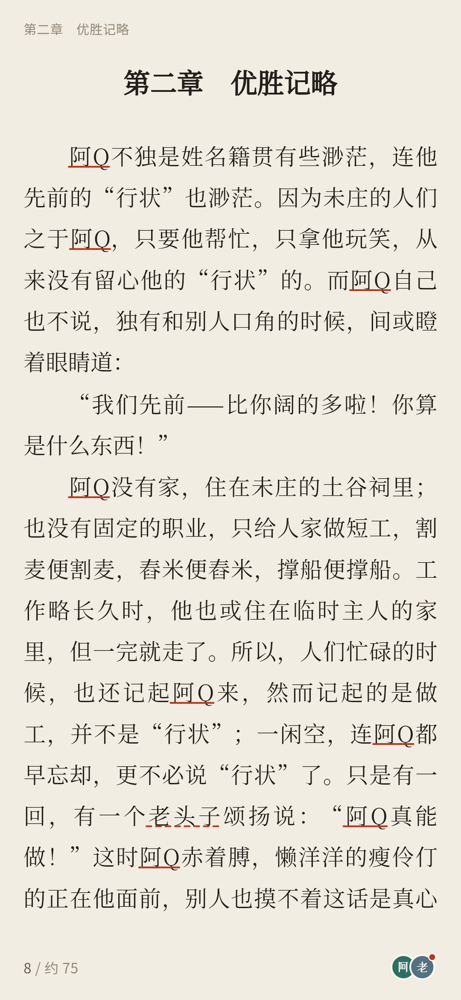

<p align="center">
  
</p>

<h1 align="center">Thusfar · 页读</h1>

<p align="center"><strong>Stay in the story. Never read ahead by accident.</strong></p>

<p align="center">
  Open a name, follow a relationship, or ask what happened. Every answer ends at your current page.
</p>

<p align="center">
  <a href="https://github.com/athemeroy/thusfar/releases/latest"><strong>Download 2.0</strong></a>
  &nbsp;·&nbsp; <a href="https://athemeroy.github.io/thusfar/"><strong>Read in your browser</strong></a>
  &nbsp;·&nbsp; <a href="#see-it-in-action">See the app</a>
  &nbsp;·&nbsp; <a href="README.zh-CN.md">简体中文</a>
</p>

---

A long novel brings back names you have not seen for hundreds of pages. Looking one up on the web can give away the ending. Thusfar marks where each clue first appears. Character cards, relationships, recaps, and answers stop at your current reading position. Go back a chapter, and they go back with you.

## See it in action

<p align="center">
  
  &nbsp;
  
</p>

<p align="center"><sub>Your library · A page with names you can open</sub></p>

- **Tap a name.** See a character's identity, aliases, appearances, and relationships, then check the original passage.
- **Catch up without looking ahead.** The cast list, relationship graph, recaps, and questions share the same reading cutoff. Answers link back to cited passages.
- **Make the book yours.** Import TXT or EPUB, take notes, add bookmarks, and search. Adjust type size, line spacing, letter spacing, and page margins to fit your screen. Your books and reading history stay on your device.
- **Stay with the page.** Reading controls appear over the page without moving the text. Cover page turns follow your gesture and settle smoothly when you let go.
- **Choose your own model.** Add a model API to prepare character guides. If free checking is unavailable, you can let one book continue using your configured model or TypeSafe AI's Jev API, or add a funded classifier.dev workspace key. Each credential is stored separately; Jev use requires an explicit choice for each book, with a visible allowance you can extend. Preparation uses a connection; everyday reading works offline.
- **Keep your place while preparing.** Short network outages retry automatically without discarding completed work. Open a book's details to see the current step, resume processing, or export a diagnostic record that excludes book text and API keys.
- **Take your library along.** Export a complete book backup with its text, reading position, notes and preparation data, then import it in another client. You can also move immutable snapshots through your own WebDAV folder.

## Download

Get the installation file for your device from the [latest release](https://github.com/athemeroy/thusfar/releases/latest).

You can also [open the browser reader](https://athemeroy.github.io/thusfar/) without installing anything. Import TXT or EPUB up to 16 MB, read, search, bookmark, take notes, and tune the typography. Books and progress stay in the site's browser IndexedDB: **updating the page at the same URL does not clear your library**. Importing a book does not upload it to GitHub. The book menu exports a complete JSON backup for transfer between the browser and installed clients. Reimporting the same book merges compatible reading data and reports conflicts instead of silently overwriting it.

The browser can prepare cited drafts of character clues, relationships, and recaps, and answer book questions from the reading page. Tap the preparation icon by a book cover, choose the first chapter, chapters you have finished, or the whole book, then enter **your own** compatible endpoint, model, and API key. Only an explicit start sends the selected text to that provider. Each passage may be requested up to twice. **The provider may charge for these calls; GitHub hosting does not include free model usage.** Your key remains in the current tab's memory and must be entered again after a refresh. Completed passages are saved locally, but processing resumes only when you ask. The panel menu can export a diagnostic record without book text or keys. Unread chapters stay hidden by default; the installed client's character biographies have a separate verification pipeline. A TypeSafe / Jev key cannot be used with the default DeepSeek endpoint, and a custom provider must allow browser cross-origin requests.

Both installed and browser clients can manually upload a new snapshot to your HTTPS WebDAV folder and import one from another device. In the browser, the WebDAV server must allow this page's origin through CORS. Snapshots do not automatically overwrite another device. Clearing site data in the browser or on the device can still remove the local library, so export important books or keep WebDAV snapshots. GitHub Pages projects on the same `athemeroy.github.io` host share a browser origin and can access that origin's storage.

| Platform | File | Installation |
| --- | --- | --- |
| Web | [Open Thusfar](https://athemeroy.github.io/thusfar/) | Open in a current browser; no installation or account. |
| Android 8+ | APK | Install the APK. The app appears as 页读. |
| macOS 12+ | DMG | Drag Thusfar to Applications. You may need to allow its first launch in Privacy & Security. |
| Windows 10/11 x64 | Installer or portable ZIP | Install for your user account or extract the ZIP. |
| Linux x64 | tar.gz | Extract and run `./thusfar`; GTK 3 is required. |
| iOS / iPadOS 15+ | Unsigned IPA | Sign and sideload with AltStore or SideStore. |

Android 2.0 can coexist with 1.7.x; each app has its own library. To move books over, export a backup in 1.7.x and restore it in 2.0. [Version 1.7.5 remains available](https://github.com/athemeroy/thusfar/releases/tag/v1.7.5).

## Your data

There is no required Thusfar account or Thusfar server. Books and notes are stored locally in the client. The installed app keeps model credentials in its private app directory; the browser keeps a key only in the current page's memory. When you choose to prepare a guide, relevant passages go to the model provider you configure. The installed app may also check passages with classifier.dev; if you enable Jev for that book, relevant passages go to TypeSafe AI as well. Choose a provider that suits your privacy needs.

## Build from source

The client consists of the Flutter interface in `app/` and the Dart reading engine in `core/`. The 2.0 release uses Flutter 3.47.5 / Dart 3.13.4. Android builds also need JDK 17 and an Android SDK.

```sh
cd app
flutter pub get
flutter run
```

The Android 2.0 package uses the `probe` build flavor:

```sh
flutter build apk --release --flavor probe --target-platform android-arm64
```

To build the static browser client for this repository's GitHub Pages path:

```sh
flutter build web --release --target lib/main_web.dart --base-href /thusfar/
```

See the [client guide](app/README.md) for development and checks, and [CONTRIBUTING.md](CONTRIBUTING.md) to contribute. Thanks to Luna and Gemini Flash for their contributions to the 2.0 client.

## License

[MIT](LICENSE). Bundled fonts retain their own licenses.
